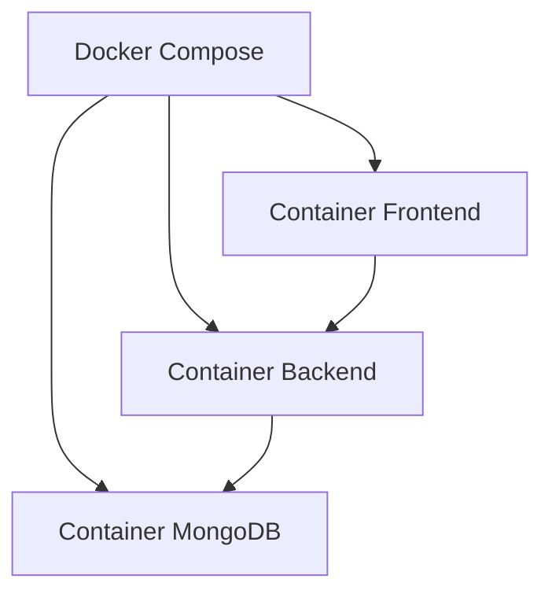

# Blog de Posts Acadêmicos


Sistema web para **visualização e gerenciamento de posts**, com dois perfis principais de acesso:

- **Aluno**: visualiza, busca e lê posts
- **Professor**: realiza login e gerencia os conteúdos publicados

---

## Sobre o projeto

O projeto foi desenvolvido com o objetivo de disponibilizar uma plataforma simples e funcional para publicação e consulta de posts acadêmicos.

A aplicação permite que **alunos**, sem necessidade de autenticação, possam navegar pelos conteúdos publicados, realizar buscas por palavras-chave e acessar a leitura completa dos posts.

Já os **professores** possuem acesso autenticado à área administrativa, onde podem:

- criar novos posts
- editar posts existentes
- excluir publicações
- buscar conteúdos específicos com facilidade

A solução foi organizada em uma arquitetura baseada em **containers**, separando claramente as responsabilidades entre **frontend**, **backend** e **banco de dados**.

---

## Tecnologias utilizadas

### Frontend
- React
- Vite

### Backend
- Node.js

### Banco de dados
- MongoDB

### Infraestrutura
- Docker

---

## Arquitetura do sistema

O sistema é composto por três serviços principais:

### 1. Frontend
Camada responsável pela interface com o usuário.  
Permite navegação, busca, visualização de posts, autenticação do professor e acesso à área administrativa.

### 2. Backend
Camada responsável pelas regras de negócio da aplicação.  
Processa requisições do frontend, valida credenciais e executa operações de CRUD dos posts.

### 3. Banco de dados
Camada responsável pela persistência das informações da aplicação, como posts e dados de autenticação.

### Visão arquitetural


---
## Pré-requisitos

Antes de executar o projeto, é necessário ter instalado em sua máquina:

- o projeto clonado ou baixado localmente
- Docker
- MongoDB

> Também é importante garantir que o Docker esteja em execução antes de iniciar a aplicação.

---

## Setup inicial

Para iniciar o projeto localmente, siga os passos abaixo.

### 1. Acesse a pasta raiz do projeto

Abra o terminal na pasta onde o projeto está salvo.

### 2. Execute o comando abaixo

```bash
docker compose up --build -d
